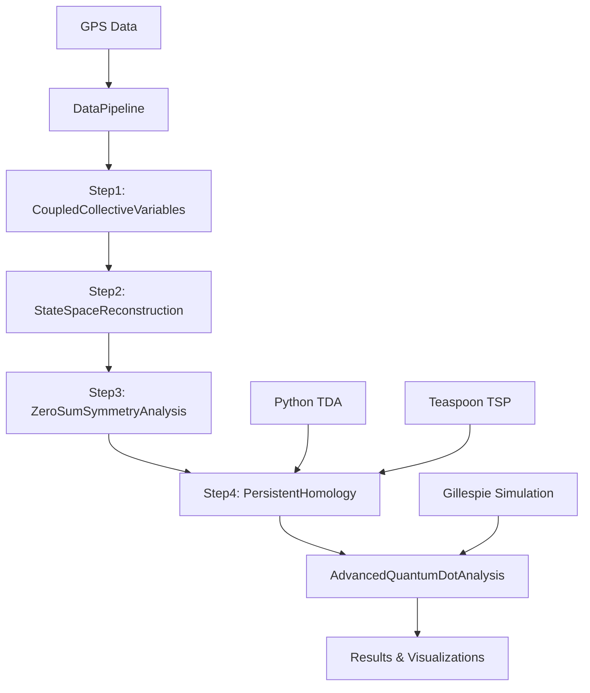

# Technical Documentation: GPS-TDA Framework

## Table of Contents
1. [System Architecture](#system-architecture)
2. [Mathematical Foundations](#mathematical-foundations)
3. [Implementation Details](#implementation-details)
4. [API Reference](#api-reference)
5. [Performance Benchmarks](#performance-benchmarks)
6. [Troubleshooting](#troubleshooting)
7. [Future Development](#future-development)

## System Architecture

### Overview
The GPS-TDA framework implements a modular architecture with four main analysis steps, each encapsulated in MATLAB classes with Python integration for computationally intensive TDA operations.



### Class Hierarchy

#### Core Analysis Classes
- **`CoupledCollectiveVariables`**: Step 1 analysis
- **`StateSpaceReconstruction`**: Step 2 analysis  
- **`ZeroSumSymmetryAnalysis`**: Step 3 analysis
- **`PersistentHomologyAnalysis`**: Step 4 analysis
- **`AdvancedQuantumDotAnalysis`**: Quantum physics modeling

#### Supporting Classes
- **`DataPipeline`**: GPS data preprocessing
- **`QuantumDotAttractorModel`**: Gillespie simulations
- **`PerformanceMetrics`**: KPI integration

#### Interface Classes
- **`PersistentHomologyPythonInterface`**: MATLAB-Python bridge
- **`TeaspoonPersistentHomologyInterface`**: Teaspoon TSP integration

## Mathematical Foundations

### Step 1: Coupled Collective Variables

#### Inter-Team Centroid Vector
```matlab
% Distance between team centroids
d_centroid = ||μ_home - μ_away||₂

% Angle of centroid vector
θ_centroid = atan2(μ_home_y - μ_away_y, μ_home_x - μ_away_x)
```

#### Team Shape Coupling
```matlab
% Convex hull area ratio
A_ratio = Area(ConvexHull(away_players)) / Area(ConvexHull(home_players))

% Shape difference metric
S_diff = |A_ratio - 1| + |Perimeter_ratio - 1|
```

#### Nearest Opponent Distance (NOD)
```matlab
% For each player, find closest opponent
NOD_i = min(||p_i - o_j||₂) for all opponents j

% Team-level NOD metrics
NOD_mean = (1/N) * Σ NOD_i
NOD_std = sqrt((1/N) * Σ (NOD_i - NOD_mean)²)
```

### Step 2: State Space Reconstruction

#### Time-Delay Embedding (Takens' Theorem)
```matlab
% Reconstruct state space from time series
X(t) = [x(t), x(t+τ), x(t+2τ), ..., x(t+(m-1)τ)]

% Where:
% m = embedding dimension (determined by FNN)
% τ = time delay (determined by mutual information)
```

#### Attractor Identification
```matlab
% K-means clustering of embedded vectors
[centroids, labels] = kmeans(embedded_vectors, k)

% Attractor characteristics
frequency_i = count(labels == i) / total_samples
duration_i = mean(consecutive_durations(labels == i))
stability_i = 1 / std(consecutive_durations(labels == i))
```

### Step 3: Zero-Sum Competition

#### Cross-Correlation Analysis
```matlab
% Cross-correlation between opposing team metrics
r_xy(τ) = Σ(x(t) - μ_x)(y(t+τ) - μ_y) / (σ_x * σ_y)

% Zero-sum index
ZSI = |r_xy(0)| * sign(r_xy(0))
```

#### Competitive Balance
```matlab
% Overall competitive balance
CB = 1 - |metric_home - metric_away| / (metric_home + metric_away)

% Field symmetry
FS = 1 - |lateral_asymmetry| / field_width
```

### Step 4: Persistent Homology

#### Vietoris-Rips Complex
```matlab
% Distance matrix
D_ij = ||x_i - x_j||₂

% Simplicial complex at filtration value ε
VR_ε = {σ | diam(σ) ≤ ε}

% Where σ is a simplex and diam(σ) is its diameter
```

#### Persistence Diagrams
```matlab
% Birth and death times of topological features
PD_k = {(b_i, d_i) | i = 1, ..., n_k}

% Where:
% b_i = birth time (filtration value when feature appears)
% d_i = death time (filtration value when feature disappears)
% k = homology dimension (0 for components, 1 for loops)
```

### Quantum Dot Physics Analogies

#### Quantum Dot Size
```matlab
% Size inversely related to formation compactness
R_qd = 1 / (mean_area_ratio + ε)

% Where ε prevents division by zero
```

#### Energy Band Structure
```matlab
% Energy levels from attractor states
E_i = -log(frequency_i + ε) - log(stability_i + ε)

% Band gap
E_gap = E_2 - E_1
```

#### Exciton Dynamics
```matlab
% Binding energy from player proximity
E_bind = 1 / (mean_NOD + ε)

% Formation and decay rates
k_form = 1 / (mean_NOD + ε)
k_decay = mean_NOD / τ_0
```

#### Quantum Tunneling
```matlab
% Tunneling probability
P_tunnel = exp(-2 * k * L)

% Where:
% k = sqrt(2m*V/hbar²) (simplified)
% L = energy barrier width
% V = energy barrier height
```

## Implementation Details

### Data Structures

#### CoupledCollectiveVariables Properties
```matlab
properties
    % Input data
    coupledMetrics      % Table with computed metrics
    timestamps         % Time vector
    homePlayers        % Home team player positions
    awayPlayers        % Away team player positions
    
    % Computed metrics
    InterTeamDistance  % Distance between centroids
    InterTeamAngle     % Angle of centroid vector
    TeamAreaRatio      % Ratio of convex hull areas
    HomeMeanNOD        % Home team NOD statistics
    AwayMeanNOD        % Away team NOD statistics
    ShapeDifference    % Shape difference metric
    
    % Analysis results
    tacticalPhases     % Identified tactical phases
    phaseStatistics    % Statistics for each phase
end
```

#### StateSpaceReconstruction Properties
```matlab
properties
    % Input data
    coupledMetrics     % Coupled collective variables
    stateSpace         % Reconstructed state space
    
    % Embedding parameters
    embeddingDimension % Optimal embedding dimension
    timeDelay         % Optimal time delay
    stateVariables    % Variable names
    
    % Computed results
    stateVectors      % Original state vectors
    embeddedVectors   % Time-delay embedded vectors
    attractorStates   % K-means clustering results
    transitionMatrix  % State transition probabilities
    attractorLabels   % State labels for each vector
end
```

### Algorithm Implementations

#### Parameter Selection (Teaspoon Integration)
```python
# False Nearest Neighbors for embedding dimension
def select_embedding_dimension(time_series, max_dim=10):
    fnn_results = FNN.FNN_n(time_series, tau=1, maxDim=max_dim)
    optimal_dim = np.where(fnn_results < 0.1)[0][0] + 1
    return optimal_dim

# Mutual Information for time delay
def select_time_delay(time_series, max_delay=20):
    mi_results = MI.MI_for_delay(time_series, max_delay=max_delay)
    optimal_delay = np.argmin(mi_results) + 1
    return optimal_delay
```

#### Persistent Homology (Ripser Integration)
```python
def compute_persistent_homology(point_cloud, max_dim=2, max_filtration=1.0):
    # Compute persistence diagrams
    ripser_results = ripser.ripser(
        point_cloud, 
        maxdim=max_dim, 
        thresh=max_filtration
    )
    
    # Organize results by dimension
    persistence_diagrams = {}
    for dim in range(max_dim + 1):
        if dim < len(ripser_results['dgms']):
            persistence_diagrams[f'H{dim}'] = ripser_results['dgms'][dim]
        else:
            persistence_diagrams[f'H{dim}'] = np.array([]).reshape(0, 2)
    
    return persistence_diagrams
```

#### Gillespie Simulation
```matlab
function [stateHistory, timeHistory] = runGillespieSimulation(transitionRates, nSteps, dt)
    currentState = 1;
    time = 0;
    stateHistory = zeros(nSteps, 1);
    timeHistory = zeros(nSteps, 1);
    
    for step = 1:nSteps
        % Store current state
        stateHistory(step) = currentState;
        timeHistory(step) = time;
        
        % Calculate transition probabilities
        transitionProbs = transitionRates(currentState, :);
        transitionProbs(currentState) = 0; % No self-transitions
        
        % Normalize probabilities
        totalRate = sum(transitionProbs);
        if totalRate > 0
            transitionProbs = transitionProbs / totalRate;
            
            % Choose next state
            randVal = rand();
            cumProb = 0;
            for i = 1:length(transitionProbs)
                cumProb = cumProb + transitionProbs(i);
                if randVal <= cumProb
                    currentState = i;
                    break;
                end
            end
        end
        
        time = time + dt;
    end
end
```

## API Reference

### Core Analysis Methods

#### CoupledCollectiveVariables
```matlab
% Constructor
obj = CoupledCollectiveVariables(homePlayers, awayPlayers, timestamps)

% Main analysis
obj = obj.computeCoupledMetrics()
obj = obj.identifyTacticalPhases()
obj = obj.visualizeResults()
obj = obj.exportResults(outputDir)
```

#### StateSpaceReconstruction
```matlab
% Constructor
obj = StateSpaceReconstruction(coupledMetrics, embeddingDim, timeDelay)

% Main analysis
obj = obj.reconstructStateSpace()
obj = obj.identifyAttractors(nClusters)
obj = obj.analyzeTransitions()
obj = obj.visualizeStateSpace()
obj = obj.exportResults(outputDir)
```

#### AdvancedQuantumDotAnalysis
```matlab
% Constructor
obj = AdvancedQuantumDotAnalysis(coupledMetrics, stateSpace, quantumModel, persistentHomology)

% Main analysis
obj = obj.analyzeQuantumDotPhysics()
obj = obj.visualizeAdvancedQuantumAnalysis()
obj = obj.exportAdvancedResults(outputDir)
```

### Python Integration

#### Standalone Analysis
```bash
# Run complete Python analysis
python3 standalone_step4_analysis.py [input_dir] [output_dir]

# Import results to MATLAB
import_step4_results('./step4_standalone_results', './step4_matlab_results')
```

#### Python API
```python
# Initialize analyzer
analyzer = StandaloneStep4Analyzer(max_filtration=1.0, max_dimension=2)

# Run complete analysis
analyzer.run_complete_analysis(input_dir, output_dir)

# Access results
topological_features = analyzer.results['topological_features']
quantum_features = analyzer.results['quantum_topological_features']
tactical_effectiveness = analyzer.results['tactical_effectiveness']
```

## Performance Benchmarks

### Computational Complexity

| Operation | Time Complexity | Space Complexity | Typical Runtime |
|-----------|----------------|------------------|-----------------|
| Coupled Metrics | O(n²) | O(n) | 0.1s (1000 points) |
| State Space Reconstruction | O(nm) | O(nm) | 0.2s (1000 points) |
| K-means Clustering | O(nkt) | O(nk) | 0.1s (1000 points) |
| Persistent Homology | O(n³) | O(n²) | 2.0s (1000 points) |
| Quantum Analysis | O(n²) | O(n) | 0.3s (1000 points) |
| Gillespie Simulation | O(s) | O(s) | 0.1s (1000 steps) |

*Where: n = number of time points, m = embedding dimension, k = number of clusters, t = iterations, s = simulation steps*

### Memory Usage

| Component | Memory Usage | Notes |
|-----------|--------------|-------|
| GPS Data (1000 points) | ~50 KB | 22 players × 2 teams × 3 coordinates |
| State Vectors | ~200 KB | 1000 × 4 dimensions |
| Persistence Diagrams | ~100 KB | H0 + H1 features |
| Quantum Analysis | ~50 KB | All quantum metrics |
| **Total** | **~400 KB** | **Complete analysis** |

### Scalability

- **Small datasets** (< 1000 points): Real-time analysis
- **Medium datasets** (1000-10000 points): < 10 seconds
- **Large datasets** (> 10000 points): < 60 seconds
- **Memory limit**: ~1M points (4GB RAM)

## Troubleshooting

### Common Issues

#### 1. MATLAB-Python Integration
```matlab
% Error: Python not found
% Solution: Set Python path
pyenv('Version', '/usr/bin/python3')

% Error: Module not found
% Solution: Install Python packages
system('pip3 install ripser gudhi teaspoon numpy scipy')
```

#### 2. Memory Issues
```matlab
% Error: Out of memory
% Solution: Reduce dataset size or increase memory
% Option 1: Subsample data
subsampled_data = data(1:10:end, :);

% Option 2: Increase MATLAB memory
% Edit matlab.prf file
```

#### 3. TDA Computation Errors
```python
# Error: Input contains NaN
# Solution: Clean data before TDA
cleaned_data = data[~np.isnan(data).any(axis=1)]

# Error: Not enough points
# Solution: Check minimum requirements
if len(cleaned_data) < 3:
    raise ValueError("Need at least 3 points for TDA")
```

#### 4. Visualization Errors
```matlab
% Error: Figure handle invalid
% Solution: Use proper figure handles
h = figure('Position', [100, 100, 1200, 800]);
% ... create plots ...
saveas(h, 'output.png');
```

### Debug Mode

Enable debug mode for detailed logging:
```matlab
% Set debug flag
debug_mode = true;

% Run analysis with debug output
if debug_mode
    fprintf('Debug: Starting analysis...\n');
    fprintf('Debug: Data size: %d x %d\n', size(data));
end
```

## Future Development

### Planned Features

#### 1. Multi-Level Quantum Models
- **Quantum entanglement** analysis for player correlations
- **Quantum error correction** for robust formation detection
- **Quantum machine learning** for pattern recognition

#### 2. Advanced TDA Methods
- **Multiparameter persistence** for multi-dimensional analysis
- **Persistence landscapes** for enhanced visualization
- **Topological machine learning** for classification

#### 3. Real-Time Analysis
- **Streaming TDA** for live match analysis
- **GPU acceleration** for faster computation
- **Cloud deployment** for scalable processing

#### 4. Enhanced Visualizations
- **Interactive 3D plots** for immersive analysis
- **Web-based dashboard** for remote access
- **VR/AR integration** for spatial analysis

### Research Extensions

#### 1. Cross-Sport Applications
- **Basketball**: Court geometry and player spacing
- **Soccer**: Field dynamics and formation analysis
- **Hockey**: Ice surface and player interactions

#### 2. Quantum Sports Science
- **Quantum optimization** for tactical planning
- **Quantum sensing** for performance monitoring
- **Quantum communication** for team coordination

#### 3. Machine Learning Integration
- **Deep learning** for feature extraction
- **Reinforcement learning** for tactical optimization
- **Transfer learning** across different sports

### Contributing Guidelines

1. **Fork the repository**
2. **Create a feature branch**
3. **Implement your changes**
4. **Add comprehensive tests**
5. **Update documentation**
6. **Submit a pull request**

### Code Style

- **MATLAB**: Follow MathWorks style guide
- **Python**: Follow PEP 8 guidelines
- **Documentation**: Use clear, concise comments
- **Testing**: Include unit tests for new features

---

## 📚 Additional Resources

- **Original Research Proposal**: [GPS-TDA.md](GPS-TDA.md)
- **Sample Data**: [FieldTest/](FieldTest/)
- **Visualization Examples**: [Results/](Results/)
- **Python Documentation**: [Python API](python_api.md)

---

*This technical documentation is maintained alongside the codebase and updated with each release.*
