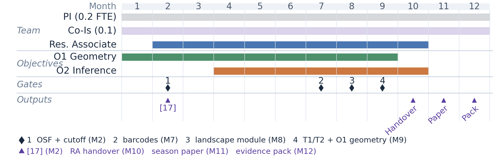

# VISION AND APPROACH

<!-- JeS Vision & Approach. REVISION 3, 24 Aug 2026. Working draft.
     Base: 02_Vision_and_Approach_REV2.md. STRIP this comment before submission.

     WHAT REV3 CHANGES vs REV2
     Corrections of fact:
       - Covariate cells: phase of play removed from the crossing (it is a
         within-match factor). Stratification is venue x opponent strength
         = 6 cells at ~90 matches, comfortably above the 32 needed for a
         95% CI half-width of 0.025. REV2's 18 cells gave 30, not 32.
       - Formation power: 180 per class now scoped to "the three most
         common formations" as a pre-registered comparison set. At one
         focal team per fixture, 540 obs / 180 = exactly 3 balanced
         classes, which real formation distributions do not supply.
       - Cutoff stability redefined as the cross-epoch stability score of
         [22] (pilot values 0.96 / 0.84 / 1.00), NOT an ICC. The 0.80
         threshold now has provenance again.
       - "Mixing verified" relabelled "Dependence diagnostic"; autocovariance
         decay is consistent with summable mixing, not proof of it.
       - Wasserstein removed from the O1 landscape-distance sentence
         (Wasserstein is a diagram metric).
       - "Validates the theorems" -> proves the theorems / tests their
         operational consequences.
       - R3 now disclaims the T1 LIMIT LAW, not T1 uniqueness (uniqueness
         is the routine precondition under the REV2 framing).
       - Detection threshold and localisation bound separated in §5 T2.
         They are different objects; REV2 equated them.
       - n^(-1/2) consistency -> sqrt(n)-consistency with a Gaussian limit.
       - p = 0.051 attributed to the stratified permutation test.

     Restored (lost between V8.9 and REV2):
       - 1 Hz justification (sub-2 s frame homology, embarrassingly
         parallel) AND the Month-2 check that 1 Hz preserves features
         validated at 10 Hz. Pilot cutoffs came from 10 Hz SkillCorner data.
       - Geometric baselines [20,21] in O1, so §3's "unavailable from
         conventional geometry" has support.
       - OSF pre-registration locus and date (Month 2), so R2 has a locus.
       - Economic/security pathway in the Standard Grant paragraph, per
         CANONICAL_NUMBERS.md.

     De-densification (REV2 regressed: mean 16.9 -> 20.7 w, max 42 -> 63 w):
       - §7 Team 63-word sentence split into six.
       - §5 T2 46-word bound sentence split; equation set as display.
       - Semicolons reduced; one aside per sentence maximum.
       Achieved: mean 14.8 w, max 33 w, zero sentences over 35 w,
       every section mean <= 17 w. Load units per sentence down in all
       seven sections.

     WORD COUNT: body 1926 w, against current draft 1608 w and REV2's
     self-imposed ~1660 cap. OVER BY ~266. The overage is concentrated in
     §4 (+143 vs REV2) and §5 (+97 vs REV2), which is where the factual
     corrections and the restored 1 Hz / baseline material sit.
     Prioritised cut list if the page allowance binds:
       1. Compress §5 T1/T2 to their claims only (~80 w). The technical
          detail is duplicated in T1_T2_Six_Registers.md register 3, which
          exists to carry it for reviewer responses.
       2. Sample-size prose tightening, keeping all figures (~25 w).
       3. §1 opener and Importance trimming (~20 w).
       That reaches ~1800. Going below that means dropping a restoration:
       cheapest to lose is the R3 third sentence (~14 w), then the
       terminology-definition clause in O1 (~12 w). Do NOT drop the 1 Hz
       preservation check or the geometric baselines - the first closes a
       10 Hz -> 1 Hz downsampling objection, the second is the only
       support for §3's "unavailable from conventional geometry".

     Terminology fixed (review item):
       - "organisational state" is the general object; "tactical formation"
         is its football label. Defined once in O1, then used consistently.
       - "competitive" fixed on three forms only: competitive collective
         systems (the class), competitive dependence (the property),
         bounded competitive system (the transfer scope).

     Toy model: NOT cited. T1/T2 stand on their own hypotheses. The toy
     model is repositioned as demonstrated evidence for the R3 fallback
     (diagram-valued W1/W2 CUSUM), which is what it actually computes.
     CLOSED 24 Aug 2026: AdversarialTDA_Specification.md restated to the
     convergence framing (lines 13, 100, 298), and the figures renamed to
     fig4_frechet_diagram_mean.png / fig8_montecarlo_cusum_delay.png.
     Ruling R8 in FOUNDATION.md.

     REFERENCES RENUMBERED to unsrtnat order of first appearance (project
     rule .cursor/rules/vancouver-referencing.mdc). All 28 cited, no orphans.
     OLD -> NEW map for syncing 04_References.md and CANONICAL_NUMBERS.md:
       1->1   2->2   3->3   4->4   5->5   6->6   7->10  8->7
       9->18  10->19 11->14 12->15 13->16 14->17 15->20 16->21
       17->22 18->27 19->11 20->23 21->24 22->25 23->28 24->8
       25->9  26->12 27->13 28->26
     Open actions: 04_References.md still has 23 entries; CANONICAL_NUMBERS.md
     still records the methodology paper as [19] and the football paper as [22].

     Figure 1: Gantt only (grant_figure_gantt.png). Relabel required -
     "methods paper [22]" not "[17] (M2)"; add Month-2 cutoff gate and
     Month-9 O1 gate as separate diamonds; add OSF pre-registration M2. -->

## Vision

### 1. Research Problem and Mathematical Contribution

This project builds the statistical-topology framework that competitive collective systems currently lack, and proves the two theorems that make it usable. These are agents distributed in a bounded domain, coordinating internally while responding to an active adversary: autonomous multi-agent coordination, biological collectives, tactical team sports. Statistical topology can already summarise spatial organisation where observations are independent or exchangeable. No framework yet quantifies how large-scale organisation forms, changes and breaks down under competition. This grant is a proof of principle. It proves both theorems, then tests their consequences at season scale on a fully tracked platform (professional football, §2). The result is the evidence base for a follow-on Standard Grant.

**Importance.** Two obstacles limit existing approaches.

*Scale.* Organisation exists at several spatial scales at once: small interaction groups, larger formations and enclosed coverage regions. Persistent homology is multi-scale in its filtration parameter. But a single filtration over the full agent set does not separate these levels, so features from different levels interleave in one diagram [1–3]. Multiparameter persistence [4,5] is a principled alternative, but is computationally impractical at the data rates required here.

*Dependence.* Each agent continuously adapts to its opponents. This violates the exchangeability assumptions underpinning current statistical topology [6,7]. Inference that treats successive observations as independent understates the uncertainty.

**Mathematical contribution.** The project targets two theorems (§5).

**(T1) Averaging under competitive dependence is well posed.** The empirical mean path of landscape summaries converges under temporal mixing rather than exchangeability. Its limiting covariance is the long-run covariance, not the marginal one [6,8,9]. Competitive dependence does not move the mean; it changes every variance built on it.

**(T2) Transitions are localised with a proven error bound.** The bound is governed by the size of the change, T1's long-run variance and the worst-case perturbation of the input diagrams [10–13]. Below an explicit threshold set by that perturbation, a transition cannot be located at all.

Both are explicit, checkable claims with named failure conditions. O1 establishes the population-scale geometry they rest on, and O2 delivers the proofs (§4). If the landscape argument proves intractable, the R3 fallback applies (§6).

### 2. Background, Timeliness, Need and Opportunity

Topological methods can already detect and quantify spatial organisation in multi-agent systems. Established results assume that the organisation is cooperative or slowly evolving: biological aggregation, collective motion and flocking [14–16], and topological change-point detection [17]. These rely on persistent homology [1,2] and its statistical summaries [6,7,18]. The summaries are stable under small measurement error [7,10], and therefore comparable and averageable. Multi-scale methods exist for slowly evolving systems [19], but not for hierarchical competitive dynamics. There, conventional approaches remain single-scale geometric descriptors [20,21]. Our pilot [22] recovers three stable connected-component regimes and two complementary loop regimes across ten matches, with the scales carrying largely independent information.

**Timeliness.** Three developments have converged. Multi-scale topology and statistical comparison tools have matured [4,6,7,18]. Scalable computation now supports rigorous analysis at population scale. Fully labelled competitive tracking data have reached that same scale. No statistical-topology treatment of competitive collective systems combines all three.

**Need and opportunity.** The gap is specific: no validated statistical-topology workflow exists for systems generated by continuous competitive interaction. Professional football is a well-observed platform on which to close it. All agents are continuously tracked within strict boundaries, and domain experts can verify the results. The framework generalises to any bounded competitive system once interaction lengths are re-derived.

### 3. Impact, National Importance and Beneficiaries

**Mathematical impact.** The primary contribution is new statistical-topology theory for dependent competitive systems. It extends current foundations [6,7] to sequential adversarial dynamics. Both results are implemented in an open-source library. The primary beneficiaries are researchers in topology, statistics and complex systems, who gain those foundations and the software to apply them.

**National importance.** UK groups lead internationally in statistical topology and stochastic geometry. Current methods [6,7] remain confined to static or exchangeable settings. This project develops UK capability at that frontier: statistical TDA and sequential inference for function-space-valued data.

**Economic and industry impact.** Co-developed with Swansea City AFC (SCAFC), the project delivers practitioner outputs unavailable from the geometric measures benchmarked in O1. Secondary beneficiaries are sports analytics researchers and practitioners.

**Standard Grant pathway.** The T1 and T2 foundations prepare a follow-on Standard Grant. That programme transfers the guarantees to two further classes of bounded competitive system: spatial predator–prey dynamics, including tumour–immune competition with Co-I Powathil, and competitive logistics and autonomous-fleet coordination.

## Approach

### 4. Research Design and Objectives

**Project structure.** The PI (0.2 FTE) leads framework development, analysis and publication. Two Co-Investigators (0.1 FTE combined) supply statistical and domain expertise. A Research Associate (Months 2–10) implements the pipeline and runs the full-season analysis. The post is structured postdoctoral training in statistical topology, sequential inference and competitive-systems methodology. SCAFC provides tracking data and tactical labels under its StatsBomb agreement.

**Sample-size rationale.** A full Championship season supplies the replication the ten-match pilot cannot: 552 fixtures, reducing to about 540 after pre-registered exclusions (R2). The unit of analysis is the fixture, represented by one focal team with the opponent as a covariate. The two teams in a fixture are not independent and are not counted separately. Stratifying by venue and opponent strength gives six cells of about 90 matches. The smallest cell therefore exceeds the 32 needed for a 95% CI half-width of 0.025 on the tactical-scale loop-presence rate (pilot across-match s.d. 0.072 [22]). Phase of play enters as a within-match stratum, contributing repeated measures rather than partitioning matches. For formation comparison, 180 matches per class detect Cohen's d ≥ 0.30 at 80% power (α = 0.05, BH-FDR); at 540 matches that covers the three most common formations, the pre-registered comparison set. The replication target is a borderline within-match pilot effect (stratified permutation p = 0.051).

**O1: Population-scale geometry (PI Months 1–9; RA Months 2–9).** O1 determines whether scale-specific summaries are stable enough to average at population scale, and whether distances between them distinguish organisational states. Organisational states are the general object; in football they are labelled by tactical formation. A 20-match validation batch in Months 1–2 tests whether the pilot interaction lengths transfer to Championship data, and whether 1 Hz sampling preserves the features validated at 10 Hz. O1 succeeds if all three criteria hold.

- **Cutoff stability ≥ 0.80** (gate, Month 2) — the cross-epoch stability score of [22], recomputed on the validation batch. Below this, interaction lengths are re-derived.
- **Dependence diagnostic** (gate, Month 9) — empirical autocovariance decay consistent with the summable-mixing condition T1 and T2 assume, with the eigengap required by the projected form of T2 recorded alongside.
- **Discriminability** (gate, Month 9) — separation of at least three organisational states (p < 0.05, BH-corrected), benchmarked against team length, width and convex-hull area [20,21].

The Month-2 gate licenses the start of O2. The Month-9 criteria are the hypotheses under which T1 and T2 are proved.

**O2: Inference for dependent topological processes (PI and RA, Months 4–10).** O2 proves both theorems by functional analysis of landscape-valued time series and sequential change-point detection (§5). It succeeds on two counts. Both theorems are proved under the O1 conditions. And detected change-points recover at least 70% of held-out annotated transitions within ±10 s, at a calibrated 5% false-alarm rate (permutation p < 0.05).

**Figure 1.** Twelve-month workplan: decision gates (diamonds) and dated outputs (triangles).

### 5. Methodology

**Pipeline.** A containerised Python pipeline processes each match frame as a point cloud. Agents are partitioned using empirically derived interaction lengths, validated against the pilot regimes (§2). Failure triggers the Month-2 cutoff gate. Persistent homology is computed at each accepted scale using Ripser [23], GUDHI [24] and giotto-tda [25], producing barcodes and persistence landscapes. Frame-level homology takes under two seconds and is embarrassingly parallel, so production runs at 1 Hz. For O1, landscape distributions are compared across organisational states and covariate cells by the landscape L² distance, with discriminability tested by permutation under BH-FDR correction.

**T1.** On a bounded domain with a fixed agent count, diagrams have bounded cardinality and bounded persistence. Landscapes are therefore uniformly bounded in the separable Hilbert space L² [7]. The mean path is the Bochner expectation and, by strict convexity, the unique Fréchet mean. Uniqueness fails for diagram-valued means [26], which is why we work with landscapes. This is routine, and we state it as a precondition rather than a result. The substance is the limit law. For a strictly stationary, α-mixing landscape series with summable coefficients, the empirical mean path is √n-consistent with a Gaussian limit. The covariance in that limit is the long-run covariance, not the marginal one [8,9]. That licenses functional principal component analysis (FPCA) [27] on landscape trajectories, and makes the block bootstrap the correct calibration rather than a heuristic one.

**T2.** The landscape map is 1-Lipschitz from diagrams under the bottleneck distance into the sup-norm [7]. On a bounded domain the landscape difference has support of finite measure, which converts this to an L² bound with constant C explicit in agent count and domain diameter. Boundedness supplies the total-persistence hypothesis [13]. For a functional CUSUM [11,12] on the landscape series, T2 bounds the localisation error by

|τ̂ − τ| = O_P( σ² / (Δ − 2Cε)² ),  for Δ > 2Cε.

Here Δ is the size of the change in the mean landscape, σ² is T1's long-run variance, and ε is the worst-case diagram perturbation. The identifiability threshold Δ > 2Cε is the substantive content: a transition is locatable only once it exceeds twice the measurement-induced perturbation. Two operational quantities follow. Block-bootstrap calibration sets the detection threshold at a fixed false-alarm rate, and the bound sets the localisation window reported with each detection. T2 is stated on the landscape series. FPCA scores are retained for interpretation, and the projected form additionally requires the eigengap condition recorded in O1.

### 6. Feasibility and Risk Management

The project is feasible in twelve months. The method is pilot-validated (§2), so O2 begins from established conditions. Data access is secured through the SCAFC agreement, and the computational budget is modest (§7). Three residual risks remain.

- **(R1) Scale transferability** — medium likelihood, high impact. Without transferable interaction lengths, averaging is not meaningful. The Month-2 cutoff gate is the mitigation.
- **(R2) Label uncertainty** — medium likelihood, low impact. Dual-source verification, Cohen's κ and OSF-pre-registered exclusions mitigate this. Labels affect the interpretation of O1, not the theorems.
- **(R3) Landscape theory** — low likelihood, medium impact. If the landscape argument proves intractable, O2 falls back to the diagram-valued Wasserstein comparison already demonstrated in the pilot. The T1 limit law is then not claimed. O2 still delivers the season analysis, the library and diagram-valued change-point results.

### 7. Outcomes, Team and Resources

**Publications and software.** The methodology paper [22] is already submitted; its acceptance is tracked, not costed. The dated deliverables in Figure 1 are a season-results paper, a football-analytics paper [28], a Zenodo library DOI and SCAFC practitioner outputs. The analysis plan is pre-registered on OSF at Month 2. Together these form the Month-12 evidence pack for the follow-on Standard Grant (§3).

**Team.** The project is based at Swansea University's Zienkiewicz Institute for Modelling, Data and AI. It combines expertise not previously brought together in a single grant: statistical topology (PI), mathematical oncology (Co-I Powathil) and sport and exercise science (Co-I Kilduff), with SCAFC as the industry co-development setting. This is a new collaboration bridging mathematical, biological and sporting communities, and a natural fit for the scheme's remit. Prof Kilduff turns organisational-state distinctions into tactically meaningful categories. Prof Powathil advises on the T1 well-posedness argument. The oncology pathway belongs to the Standard Grant, not to this award.

**Resources.** Full-season processing uses the PI's Supercomputing Wales allocation: approximately 1,600 of 5,000 available CPU-hours. The containerised pipeline runs on local machines and on high-performance computing clusters.

## References

*Numbered in order of first appearance (unsrtnat convention). All 28 entries are cited.*

1. Carlsson, G. (2009). Topology and data. *Bulletin of the American Mathematical Society*, 46(2), 255–308.
2. Zomorodian, A. & Carlsson, G. (2005). Computing persistent homology. *Discrete & Computational Geometry*, 33(2), 249–274.
3. Edelsbrunner, H. & Harer, J. (2010). *Computational Topology: An Introduction*. American Mathematical Society.
4. Botnan, M. B. & Lesnick, M. (2022). An introduction to multiparameter persistence. In *Representations of Algebras and Related Structures* (pp. 77–150). EMS Press.
5. Lesnick, M. (2015). The theory of the interleaving distance on multidimensional persistence modules. *Foundations of Computational Mathematics*, 15(3), 613–650.
6. Chazal, F., Fasy, B. T., Lecci, F., Rinaldo, A. & Wasserman, L. (2014). Stochastic convergence of persistence landscapes and silhouettes. *Proceedings of the 30th Annual Symposium on Computational Geometry*, 474–483.
7. Bubenik, P. (2015). Statistical topological data analysis using persistence landscapes. *Journal of Machine Learning Research*, 16(1), 77–102.
8. Bosq, D. (2000). *Linear Processes in Function Spaces: Theory and Applications*. Lecture Notes in Statistics 149. Springer.
9. Hörmann, S. & Kokoszka, P. (2010). Weakly dependent functional data. *Annals of Statistics*, 38(3), 1845–1884.
10. Cohen-Steiner, D., Edelsbrunner, H. & Harer, J. (2007). Stability of persistence diagrams. *Discrete & Computational Geometry*, 37(1), 103–120.
11. Page, E. S. (1954). Continuous inspection schemes. *Biometrika*, 41(1/2), 100–115.
12. Berkes, I., Gabrys, R., Horváth, L. & Kokoszka, P. (2009). Detecting changes in the mean of functional observations. *Journal of the Royal Statistical Society: Series B*, 71(5), 927–946.
13. Cohen-Steiner, D., Edelsbrunner, H., Harer, J. & Mileyko, Y. (2010). Lipschitz functions have L^p-stable persistence. *Foundations of Computational Mathematics*, 10(2), 127–148.
14. Topaz, C. M., Ziegelmeier, L. & Halverson, T. (2015). Topological data analysis of biological aggregation models. *PLoS ONE*, 10(5), e0126383.
15. Bhaskar, D. et al. (2019). Analysing collective motion with machine learning and topology. *Chaos*, 29(12), 123125.
16. Ballerini, M. et al. (2008). Interaction ruling animal collective behaviour depends on topological rather than metric distance. *PNAS*, 105(4), 1232–1237.
17. Gu, K. et al. (2022). Change point detection in multi-agent systems based on higher-order features. *Chaos*, 32(11), 113117.
18. Adams, H. et al. (2017). Persistence images: a stable vector representation of persistent homology. *Journal of Machine Learning Research*, 18(8), 1–35.
19. Schindler, D. J. & Barahona, M. (2023). Analysing multiscale clusterings with persistent homology. arXiv:2305.04281.
20. Folgado, H. et al. (2014). Length, width and centroid distance as measures of teams' tactical performance in youth football. *European Journal of Sport Science*, 14(S1), S487–S492.
21. Fernández, J. & Bornn, L. (2018). Wide open spaces: a statistical technique for measuring space creation in professional soccer. *Sloan Sports Analytics Conference*.
22. Brown, R. et al. (2026). Multi-scale persistent homology for competitive spatial systems: measurement-aware methods and validation in professional football. Manuscript submitted to the *Journal of Applied and Computational Topology*.
23. Bauer, U. (2021). Ripser: efficient computation of Vietoris–Rips persistence barcodes. *Journal of Applied and Computational Topology*, 5(3), 391–423.
24. Maria, C., Boissonnat, J.-D., Glisse, M. & Yvinec, M. (2014). The Gudhi library: simplicial complexes and persistent homology. In *Mathematical Software – ICMS 2014* (pp. 167–174). Springer.
25. Tauzin, G. et al. (2021). giotto-tda: a topological data analysis toolkit for machine learning and data exploration. *Journal of Machine Learning Research*, 22(39), 1–6.
26. Turner, K., Mileyko, Y., Mukherjee, S. & Harer, J. (2014). Fréchet means for distributions of persistence diagrams. *Discrete & Computational Geometry*, 52(1), 44–70.
27. Ramsay, J. O. & Silverman, B. W. (2005). *Functional Data Analysis* (2nd ed.). Springer.
28. Brown, R. et al. (2026). Multi-scale topological signatures of tactical organisation in professional football. In preparation; to be submitted to the *Journal of Sports Sciences*.
