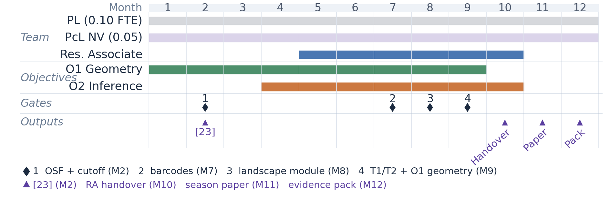

# VISION AND APPROACH

Revision history and page-fit notes: `archive/REV4_revision_header_oct2026.md`.

## Vision

### 1. Research Problem and Mathematical Contribution

When two or more groups of agents compete inside a bounded space, each shapes the other's organisation at every scale at once. Such competitive collective systems share a bounded domain, each group coordinating internally while responding to the opponent. Statistical topology cannot yet describe how such organisation forms, changes and breaks down. This project seeks that theory, averaging configurations at population scale and locating change with a proven error bound. The grant is a proof of principle on professional football as a fully tracked platform (§2) and the evidence base for a follow-on Standard Grant.

**Importance.** Two obstacles limit existing approaches. *Scale.* Organisation exists at several spatial scales at once, from small interaction groups to enclosed coverage regions. A single persistent-homology filtration over the full agent set does not separate these levels: their features interleave in one diagram [1–3]. Multiparameter persistence [4–6] is principled but computationally impractical at these data rates.

*Dependence.* Continuous mutual adaptation violates the exchangeability assumptions underpinning current statistical topology [7,8], so inference that treats observations as independent understates the uncertainty.

**Mathematical contribution.** The framework rests on two theorems this project seeks to prove (§5). **(T1) Averaging under competitive dependence is well posed.** The empirical mean path of landscape summaries converges under temporal mixing rather than exchangeability, with the long-run rather than the marginal covariance in the limit [7,9,10]. Competitive dependence does not move the mean; it changes every variance built on it.

**(T2) Transitions are localised with a proven error bound.** The bound depends on the size of the change, T1's long-run variance and the worst-case perturbation of the input diagrams [11–14]. Below a threshold set by that perturbation, a transition cannot be located. Both are explicit, checkable claims with named failure conditions; O1 establishes their geometry and O2 carries the proofs (§4, fallback §6).

### 2. Background, Timeliness, Need and Opportunity

Established topological results assume cooperative or slowly evolving organisation: biological aggregation, collective motion and flocking [15–17], and topological change-point detection [18]. These rely on persistent homology [1,2] and its statistical summaries [7,8,19], which are stable under small measurement error [8,11]. Multi-scale methods exist for slowly evolving systems [20]; competitive systems are still described by single-scale geometric descriptors [21,22]. Our ten-match pilot [23] recovers three stable connected-component regimes and two complementary loop regimes, with the scales carrying largely independent information.

**Timeliness.** Multi-scale topology and statistical comparison tools have matured [4,6–8,19], scalable computation supports rigorous analysis at population scale, and fully labelled competitive tracking data exist at that scale.

**Need.** No validated statistical-topology workflow exists for continuously competing systems. Current methods assume cooperation, slow evolution or exchangeability, so they cannot average or localise change under competitive dependence.

**Opportunity.** Professional football is the platform: all agents are tracked within strict boundaries and domain experts can verify results. That window lets T1 and T2 be proved before transfer.

### 3. Impact, National Importance and Beneficiaries

**Mathematical impact.** The primary contribution is new statistical-topology theory extending current foundations [7,8] to competitive dependence. Beneficiaries are researchers in topology, statistics and complex systems, who gain foundations for averaging and change-point inference under competitive dependence, plus an open-source library.

**National importance.** This project develops UK capability in sequential inference for function-space-valued topological summaries under competitive dependence.

**Economic and industry impact.** Co-developed with Swansea City AFC (SCAFC), the project delivers practitioner outputs unavailable from the geometric measures benchmarked in O1, so analysts can quantify pressing, formation gaps and defensive-line organisation at named scales.

**Standard Grant pathway.** The T1 and T2 foundations prepare a follow-on Standard Grant transferring the guarantees to two further bounded competitive systems: spatial predator–prey dynamics (including tumour–immune competition with mathematical-oncology collaborators) and competitive logistics with autonomous-fleet coordination.

## Approach

### 4. Research Design and Objectives

**Project structure.** The Project Lead (PL; 0.10 full-time equivalent, FTE) leads design, gates, theorems and publication; 0.10 FTE is not season-scale compute. Project co-lead (PcL) Dr Nelly Villamizar (Mathematics, 0.05 FTE) supplies algebraic guidance for O2, not implementation. A Research Associate (RA; 1.0 FTE, Months 5–10) implements season-scale compute and the landscape library on SCAFC tracking data and tactical labels. Months 1–4 are PL-led so the RA inherits a gated, specified pipeline rather than designing the stack. Months 11–12 remain PL-owned after the RA handover. The post is structured postdoctoral training in statistical topology and sequential inference.

**Sample-size rationale.** A full Championship season supplies the replication the pilot cannot: 552 fixtures, about 540 after pre-registered exclusions (R2). The unit is the fixture (one focal team, opposition as covariate), so the two dependent teams are not double-counted. Venue × opposition strength gives six cells of about 90 matches, each above the 32 needed for a 95% confidence-interval half-width of 0.025 on the tactical-scale loop-presence rate (pilot across-match s.d. 0.065 [23]). Phase of play is a within-match stratum and does not partition matches. For formation comparison, 180 matches per class detect Cohen's d ≥ 0.30 at 80% power (α = 0.05, Benjamini–Hochberg false-discovery-rate control, BH-FDR); 540 matches cover the three most common formations, the pre-registered comparison set. The replication target is a borderline within-match pilot effect (stratified permutation p = 0.051).

**O1: Population-scale geometry (PL Months 1–9; RA Months 5–9).** O1 tests whether scale-specific summaries are stable enough to average at population scale and whether their distances distinguish organisational states (in football, tactical formations). A 20-match validation batch in Months 1–2 tests whether the pilot interaction lengths transfer to Championship data, and whether 1 Hz sampling preserves the features validated at 10 Hz.

- **Cutoff acceptance** (gate, Month 2): invert the cardinality rules of [23] on the validation batch; a match outside a named connected-component band triggers re-derivation.
- **Dependence diagnostic** (gate, Month 9): empirical autocovariance decay consistent with the summable-mixing condition T1 and T2 assume, with the eigengap for T2's projected form recorded alongside.
- **Discriminability** (gate, Month 9): separation of at least three organisational states (p < 0.05, BH-corrected), benchmarked against team length, width and convex-hull area [21,22].

**O2: Inference for dependent topological processes (PL Months 4–10; RA and PcL Months 5–10).** The Month-2 gate licenses O2; the Month-9 criteria are the hypotheses under which T1 and T2 are to be proved (§5). O2 succeeds if both theorems hold under the O1 conditions and detected change-points recover at least 70% of held-out annotated transitions within ±10 s at a calibrated 5% false-alarm rate (permutation p < 0.05).

{width=13cm}

### 5. Methodology

**Pipeline.** A containerised Python pipeline processes each match frame as a point cloud. Agents are partitioned using the empirically derived interaction lengths (§2; Month-2 gate). Persistent homology at each accepted scale is computed with Ripser [24], GUDHI [25] and giotto-tda [26] and summarised as persistence landscapes. Frame-level homology takes under two seconds and is embarrassingly parallel, so production runs at 1 Hz. For O1, landscape distributions are compared across organisational states and covariate cells by the landscape L² distance (permutation tests, BH-FDR).

**T1.** On a bounded domain with a fixed agent count, landscapes are uniformly bounded in L² [8], so the mean path is well defined and unique, unlike diagram-valued means [27]. For a strictly stationary, α-mixing landscape series with summable coefficients, the empirical mean path is √n-consistent with a Gaussian limit whose covariance is the long-run, not the marginal, covariance [9,10]. That licenses functional principal component analysis (FPCA) [28] on landscape trajectories and block-bootstrap calibration.

**T2.** The landscape map is 1-Lipschitz from diagrams under the bottleneck distance into the sup-norm [8], and on a bounded domain into L² with a constant C explicit in agent count and domain diameter [14]. For a functional cumulative-sum (CUSUM) statistic [12,13] on the landscape series, T2 bounds the localisation error by

|τ̂ − τ| = O_P( σ² / (Δ − 2Cε)² ),  for Δ > 2Cε,

where Δ is the change in the mean landscape, σ² is T1's long-run variance and ε is the worst-case diagram perturbation. The threshold Δ > 2Cε is the substantive content: a transition is locatable only once it exceeds twice the measurement-induced perturbation. Block-bootstrap calibration sets the detection threshold at a fixed false-alarm rate; the bound sets the localisation window reported with each detection. T2 is stated on the landscape series; its projected form on FPCA scores also needs the eigengap condition recorded in O1.

### 6. Feasibility and Risk Management

The award is feasible in twelve months (RA Months 5–10; Months 11–12 PL-owned). The method is pilot-validated (§2), data access is secured through the SCAFC agreement, and the computational budget is modest (§7). Three risks remain.

- **(R1) Scale transferability**: medium likelihood, high impact. Without transferable interaction lengths averaging is not meaningful; the Month-2 cutoff gate mitigates this.
- **(R2) Label uncertainty**: medium likelihood, low impact. Dual-source verification, Cohen's κ and Open Science Framework (OSF) pre-registered exclusions mitigate this. Labels affect the interpretation of O1, not the theorems.
- **(R3) Landscape theory**: low likelihood, medium impact. If the landscape argument proves intractable, O2 falls back to the diagram-valued Wasserstein comparison already demonstrated in the pilot. The T1 limit law is then not claimed.

### 7. Outcomes, Team and Resources

**Publications and software.** The methodology paper [23] is submitted. The dated deliverables in Figure 1 are a season-results paper, a football-analytics paper [29], a Zenodo library DOI and SCAFC practitioner outputs. The analysis plan is pre-registered on OSF at Month 2. These form the Month-12 evidence pack for the Standard Grant (§3).

**Team.** The team brings together statistical topology for competitive systems (PL, Biomedical Engineering), applied algebraic geometry and topological methods (PcL Villamizar, Mathematics) and SCAFC as industry co-development partner. This cross-school and industry collaboration fits the scheme's remit. **Resources.** Full-season processing uses the PL's Supercomputing Wales allocation: approximately 1,600 of 5,000 available CPU-hours.

## References

*Numbered in order of first appearance (unsrtnat convention). All 29 entries are cited.*

1. Carlsson, G. (2009). Topology and data. *Bulletin of the American Mathematical Society*, 46(2), 255–308.
2. Zomorodian, A. & Carlsson, G. (2005). Computing persistent homology. *Discrete & Computational Geometry*, 33(2), 249–274.
3. Edelsbrunner, H. & Harer, J. (2010). *Computational Topology: An Introduction*. American Mathematical Society.
4. Botnan, M. B. & Lesnick, M. (2022). An introduction to multiparameter persistence. In *Representations of Algebras and Related Structures* (pp. 77–150). EMS Press.
5. Lesnick, M. (2015). The theory of the interleaving distance on multidimensional persistence modules. *Foundations of Computational Mathematics*, 15(3), 613–650.
6. Schenck, H. (2022). *Algebraic Foundations for Applied Topology and Data Analysis*. Mathematics of Data, vol. 1. Springer, Cham. doi:10.1007/978-3-031-06664-1. Chapter 8 treats the algebraic foundations of multiparameter persistent homology.
7. Chazal, F., Fasy, B. T., Lecci, F., Rinaldo, A. & Wasserman, L. (2014). Stochastic convergence of persistence landscapes and silhouettes. *Proceedings of the 30th Annual Symposium on Computational Geometry*, 474–483.
8. Bubenik, P. (2015). Statistical topological data analysis using persistence landscapes. *Journal of Machine Learning Research*, 16(1), 77–102.
9. Bosq, D. (2000). *Linear Processes in Function Spaces: Theory and Applications*. Lecture Notes in Statistics 149. Springer.
10. Hörmann, S. & Kokoszka, P. (2010). Weakly dependent functional data. *Annals of Statistics*, 38(3), 1845–1884.
11. Cohen-Steiner, D., Edelsbrunner, H. & Harer, J. (2007). Stability of persistence diagrams. *Discrete & Computational Geometry*, 37(1), 103–120.
12. Page, E. S. (1954). Continuous inspection schemes. *Biometrika*, 41(1/2), 100–115.
13. Berkes, I., Gabrys, R., Horváth, L. & Kokoszka, P. (2009). Detecting changes in the mean of functional observations. *Journal of the Royal Statistical Society: Series B*, 71(5), 927–946.
14. Cohen-Steiner, D., Edelsbrunner, H., Harer, J. & Mileyko, Y. (2010). Lipschitz functions have L^p-stable persistence. *Foundations of Computational Mathematics*, 10(2), 127–148.
15. Topaz, C. M., Ziegelmeier, L. & Halverson, T. (2015). Topological data analysis of biological aggregation models. *PLoS ONE*, 10(5), e0126383.
16. Bhaskar, D. et al. (2019). Analysing collective motion with machine learning and topology. *Chaos*, 29(12), 123125.
17. Ballerini, M. et al. (2008). Interaction ruling animal collective behaviour depends on topological rather than metric distance. *PNAS*, 105(4), 1232–1237.
18. Gu, K. et al. (2022). Change point detection in multi-agent systems based on higher-order features. *Chaos*, 32(11), 113117.
19. Adams, H. et al. (2017). Persistence images: a stable vector representation of persistent homology. *Journal of Machine Learning Research*, 18(8), 1–35.
20. Schindler, D. J. & Barahona, M. (2023). Analysing multiscale clusterings with persistent homology. arXiv:2305.04281.
21. Folgado, H. et al. (2014). Length, width and centroid distance as measures of teams' tactical performance in youth football. *European Journal of Sport Science*, 14(S1), S487–S492.
22. Fernández, J. & Bornn, L. (2018). Wide open spaces: a statistical technique for measuring space creation in professional soccer. *Sloan Sports Analytics Conference*.
23. Brown, R. et al. (2026). Multi-scale persistent homology for competitive spatial systems: measurement-aware methods and validation in professional football. Manuscript submitted to the *Journal of Applied and Computational Topology*.
24. Bauer, U. (2021). Ripser: efficient computation of Vietoris–Rips persistence barcodes. *Journal of Applied and Computational Topology*, 5(3), 391–423.
25. Maria, C., Boissonnat, J.-D., Glisse, M. & Yvinec, M. (2014). The Gudhi library: simplicial complexes and persistent homology. In *Mathematical Software – ICMS 2014* (pp. 167–174). Springer.
26. Tauzin, G. et al. (2021). giotto-tda: a topological data analysis toolkit for machine learning and data exploration. *Journal of Machine Learning Research*, 22(39), 1–6.
27. Turner, K., Mileyko, Y., Mukherjee, S. & Harer, J. (2014). Fréchet means for distributions of persistence diagrams. *Discrete & Computational Geometry*, 52(1), 44–70.
28. Ramsay, J. O. & Silverman, B. W. (2005). *Functional Data Analysis* (2nd ed.). Springer.
29. Brown, R. et al. (2026). Multi-scale topological signatures of tactical organisation in professional football. In preparation; to be submitted to the *Journal of Sports Sciences*.
